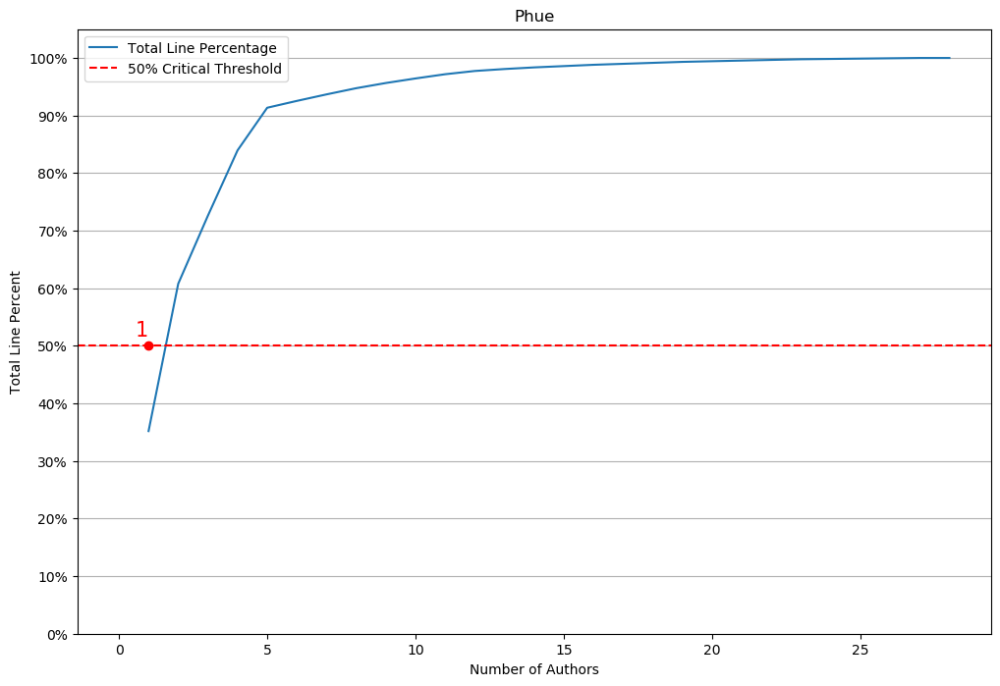
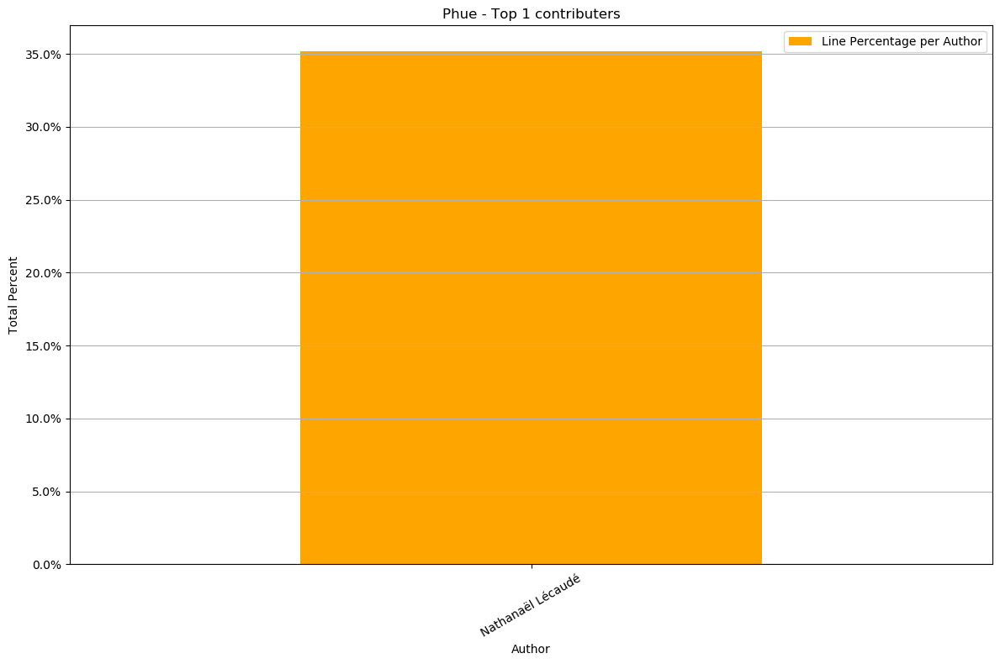
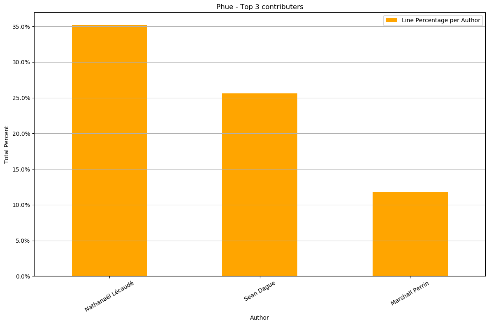
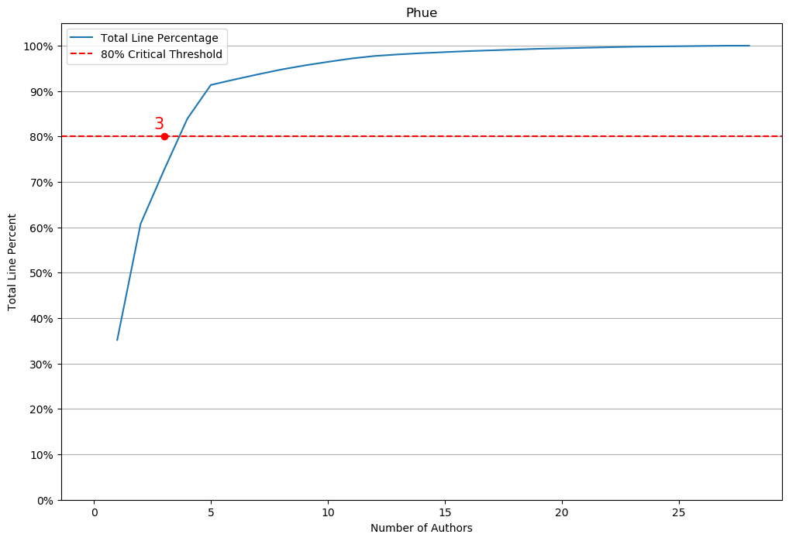

# Bus Factor

Clone a git repo and find out who has contributed the most. 


```python
from bus_class import BusFactor
```

### Instanciate the bus factor class with a repo location


```python
bf = BusFactor('https://github.com/studioimaginaire/phue')
```

Check the critical contributor threshold


```python
cc = bf.critical_threshold
print(f'The critical contributor threshold is {cc}')
```

    The critical contributor threshold is 0.5
    

### View the authors dataframe


```python
bf.authors_df
```


<div>
<style scoped>
    .dataframe tbody tr th:only-of-type {
        vertical-align: middle;
    }

    .dataframe tbody tr th {
        vertical-align: top;
    }

    .dataframe thead th {
        text-align: right;
    }
</style>
<table border="1" class="dataframe">
  <thead>
    <tr style="text-align: right;">
      <th></th>
      <th>author</th>
      <th>lines</th>
      <th>total_line_count</th>
      <th>author_count</th>
      <th>total_line_percent</th>
      <th>line_percent</th>
    </tr>
  </thead>
  <tbody>
    <tr>
      <th>0</th>
      <td>Nathanaël Lécaudé</td>
      <td>623</td>
      <td>623</td>
      <td>1</td>
      <td>0.351977</td>
      <td>0.351977</td>
    </tr>
    <tr>
      <th>1</th>
      <td>Sean Dague</td>
      <td>453</td>
      <td>1076</td>
      <td>2</td>
      <td>0.607910</td>
      <td>0.255932</td>
    </tr>
    <tr>
      <th>2</th>
      <td>Marshall Perrin</td>
      <td>209</td>
      <td>1285</td>
      <td>3</td>
      <td>0.725989</td>
      <td>0.118079</td>
    </tr>
    <tr>
      <th>3</th>
      <td>Albin Eldstål-Damlin</td>
      <td>201</td>
      <td>1486</td>
      <td>4</td>
      <td>0.839548</td>
      <td>0.113559</td>
    </tr>
    <tr>
      <th>4</th>
      <td>Justin</td>
      <td>131</td>
      <td>1617</td>
      <td>5</td>
      <td>0.913559</td>
      <td>0.074011</td>
    </tr>
    <tr>
      <th>5</th>
      <td>Paulus Schoutsen</td>
      <td>21</td>
      <td>1638</td>
      <td>6</td>
      <td>0.925424</td>
      <td>0.011864</td>
    </tr>
    <tr>
      <th>6</th>
      <td>Psychokiller1888</td>
      <td>20</td>
      <td>1658</td>
      <td>7</td>
      <td>0.936723</td>
      <td>0.011299</td>
    </tr>
    <tr>
      <th>7</th>
      <td>Stefan Jansen</td>
      <td>19</td>
      <td>1677</td>
      <td>8</td>
      <td>0.947458</td>
      <td>0.010734</td>
    </tr>
    <tr>
      <th>8</th>
      <td>carlosperate</td>
      <td>16</td>
      <td>1693</td>
      <td>9</td>
      <td>0.956497</td>
      <td>0.009040</td>
    </tr>
    <tr>
      <th>9</th>
      <td>Rolf Koenders</td>
      <td>14</td>
      <td>1707</td>
      <td>10</td>
      <td>0.964407</td>
      <td>0.007910</td>
    </tr>
    <tr>
      <th>10</th>
      <td>Manuel Naranjo</td>
      <td>13</td>
      <td>1720</td>
      <td>11</td>
      <td>0.971751</td>
      <td>0.007345</td>
    </tr>
    <tr>
      <th>11</th>
      <td>bradykent</td>
      <td>10</td>
      <td>1730</td>
      <td>12</td>
      <td>0.977401</td>
      <td>0.005650</td>
    </tr>
    <tr>
      <th>12</th>
      <td>Max Muth</td>
      <td>6</td>
      <td>1736</td>
      <td>13</td>
      <td>0.980791</td>
      <td>0.003390</td>
    </tr>
    <tr>
      <th>13</th>
      <td>Alethea Power</td>
      <td>5</td>
      <td>1741</td>
      <td>14</td>
      <td>0.983616</td>
      <td>0.002825</td>
    </tr>
    <tr>
      <th>14</th>
      <td>Tom Ritchford</td>
      <td>4</td>
      <td>1745</td>
      <td>15</td>
      <td>0.985876</td>
      <td>0.002260</td>
    </tr>
    <tr>
      <th>15</th>
      <td>Noah Martin-Ruben</td>
      <td>4</td>
      <td>1749</td>
      <td>16</td>
      <td>0.988136</td>
      <td>0.002260</td>
    </tr>
    <tr>
      <th>16</th>
      <td>Sqwabman</td>
      <td>3</td>
      <td>1752</td>
      <td>17</td>
      <td>0.989831</td>
      <td>0.001695</td>
    </tr>
    <tr>
      <th>17</th>
      <td>Rich Jeanes</td>
      <td>3</td>
      <td>1755</td>
      <td>18</td>
      <td>0.991525</td>
      <td>0.001695</td>
    </tr>
    <tr>
      <th>18</th>
      <td>Fabio Manganiello</td>
      <td>3</td>
      <td>1758</td>
      <td>19</td>
      <td>0.993220</td>
      <td>0.001695</td>
    </tr>
    <tr>
      <th>19</th>
      <td>Brandon LeBlanc</td>
      <td>2</td>
      <td>1760</td>
      <td>20</td>
      <td>0.994350</td>
      <td>0.001130</td>
    </tr>
    <tr>
      <th>20</th>
      <td>bennert</td>
      <td>2</td>
      <td>1762</td>
      <td>21</td>
      <td>0.995480</td>
      <td>0.001130</td>
    </tr>
    <tr>
      <th>21</th>
      <td>Linus Närkling</td>
      <td>2</td>
      <td>1764</td>
      <td>22</td>
      <td>0.996610</td>
      <td>0.001130</td>
    </tr>
    <tr>
      <th>22</th>
      <td>Charles Bouchard-Légaré</td>
      <td>2</td>
      <td>1766</td>
      <td>23</td>
      <td>0.997740</td>
      <td>0.001130</td>
    </tr>
    <tr>
      <th>23</th>
      <td>Ross Gardler</td>
      <td>1</td>
      <td>1767</td>
      <td>24</td>
      <td>0.998305</td>
      <td>0.000565</td>
    </tr>
    <tr>
      <th>24</th>
      <td>costas</td>
      <td>1</td>
      <td>1768</td>
      <td>25</td>
      <td>0.998870</td>
      <td>0.000565</td>
    </tr>
    <tr>
      <th>25</th>
      <td>Nathanaël Couture-Lécaudé</td>
      <td>1</td>
      <td>1769</td>
      <td>26</td>
      <td>0.999435</td>
      <td>0.000565</td>
    </tr>
    <tr>
      <th>26</th>
      <td>Johann Barnard</td>
      <td>1</td>
      <td>1770</td>
      <td>27</td>
      <td>1.000000</td>
      <td>0.000565</td>
    </tr>
    <tr>
      <th>27</th>
      <td>James Cunningham</td>
      <td>0</td>
      <td>1770</td>
      <td>28</td>
      <td>1.000000</td>
      <td>0.000000</td>
    </tr>
  </tbody>
</table>
</div>


### Plot the Bus Factor


```python
fig = bf.bus_factor_plot
fig
```





```python
print(bf.save_bus_factor_plot())
```

    Bus Factor Plot saved as: ******
    

### View and plot the critical contributors


```python
bf.critical_contributers_df
```


<div>
<style scoped>
    .dataframe tbody tr th:only-of-type {
        vertical-align: middle;
    }

    .dataframe tbody tr th {
        vertical-align: top;
    }

    .dataframe thead th {
        text-align: right;
    }
</style>
<table border="1" class="dataframe">
  <thead>
    <tr style="text-align: right;">
      <th></th>
      <th>author</th>
      <th>lines</th>
      <th>total_line_count</th>
      <th>author_count</th>
      <th>total_line_percent</th>
      <th>line_percent</th>
    </tr>
  </thead>
  <tbody>
    <tr>
      <th>0</th>
      <td>Nathanaël Lécaudé</td>
      <td>623</td>
      <td>623</td>
      <td>1</td>
      <td>0.351977</td>
      <td>0.351977</td>
    </tr>
  </tbody>
</table>
</div>


```python
bf.critical_contributers_fig
```





```python
print(bf.save_critical_plot())
```

    Critical Contributers Plot saved as: *****
    

### Change the critical threshold and plot the critical contributors


```python
bf.critical_threshold = .8
bf.critical_contributers_fig
```





```python
bf.bus_factor_plot
```





## CLI usage

#### Required Arguments
* -g, --git Url of the GitHup repository

#### Optional Arguments
* -s, --save_plots Outputs two plots:
    * {repo}_critical_contributors.png - Bar plot of the line % for each ccritical contributer
    * {repo}_bus_factor.png - Line plot of the total line % vs authors with decreasing line count
* -j, --to_json Outputs data on critical contributers and authors to .json file's
* -c, --to_csv Outputs data on critical contributers and outhors to .csv file's


```python
python bus_factor.py -g https://github.com/studioimaginaire/phue -s -j
```
